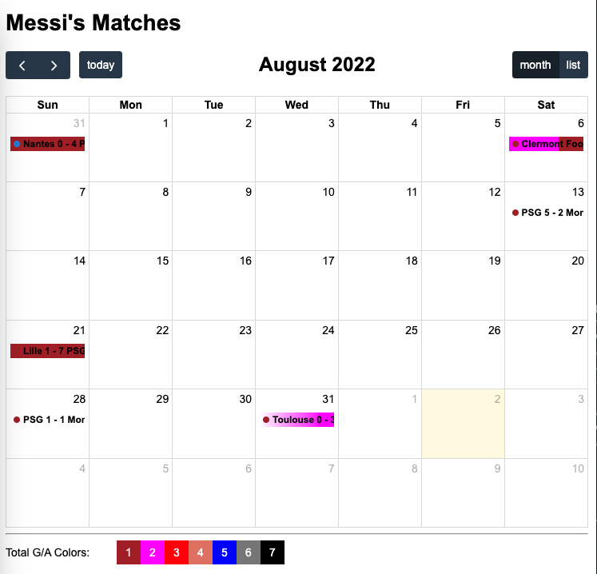

# Messi Matches

See demo at [https://messi-matches.netlify.app/](https://messi-matches.netlify.app/)

## Script

### Fetch new matches data
```
npm run fetch
```
new matches will be store at `frontend/js/matches.js`

### Run Analyst

```
pdm run start / start2
```

### Build front end JS

```
npm run build
```

## Run Front end

Open `frontend/index.html` with your browser




JS Library
- [fullcalendar](https://fullcalendar.io/docs/headerToolbar)
